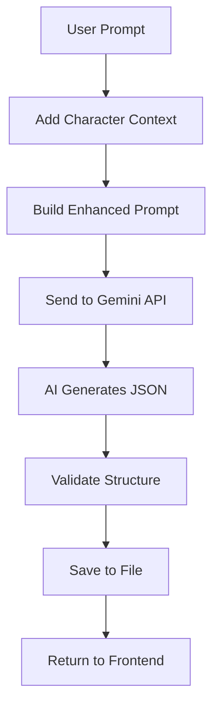

# AI Customization Guide

Learn how to customize the AI generation system to create different story types, adjust output quality, and fine-tune the Gemini model.

## Overview

TeyvatVN uses Google's Gemini 2.5 Flash model to generate visual novel scenes. This guide covers:
- Modifying AI behavior
- Creating custom story templates
- Adjusting generation parameters
- Prompt engineering techniques

---

## Understanding the AI System

### Generation Flow



### Key Files

| File | Purpose |
|------|---------|
| `backend_server/generate_ai_calls.py` | AI generation logic |
| `backend_server/main.py` | API endpoints |
| `src/pages/StoryPage.jsx` | Frontend integration |

---

## Modifying System Instructions

### Location
`backend_server/generate_ai_calls.py` → `generate_chapter_from_prompt()`

### Current System Instructions

```python
system_instructions = """You are a visual novel scene generator...

Output ONLY valid JSON in this EXACT format:
{
  "title": "Scene Title",
  "characters": ["Character1", "Character2"],
  "backgrounds": ["background_id"],
  "setting_narration": "Description",
  "segments": [...]
}

IMPORTANT RULES:
1. The "backgrounds" array must contain EXACTLY ONE background ID...
2. Choose the background that best matches the scene...
...
"""
```

### Customization Examples

#### 1. Change Story Length

```python
# Shorter stories (4-6 segments)
"""
...
6. Create 4-6 segments mixing dialogue and narration for a concise scene
...
"""

# Longer stories (15-20 segments)
"""
...
6. Create 15-20 segments mixing dialogue and narration for an epic scene
...
"""
```

#### 2. Adjust Dialogue/Narration Ratio

```python
# More dialogue-heavy
"""
...
6. Create 10-15 segments with 70% dialogue and 30% narration
7. Focus on character interactions and conversations
...
"""

# More narration-heavy
"""
...
6. Create 10-15 segments with 30% dialogue and 70% narration
7. Focus on atmospheric descriptions and internal thoughts
...
"""
```

#### 3. Add Genre Specifications

```python
# Romance focus
"""
...
GENRE: Romantic
- Include subtle romantic tension
- Use warm, intimate descriptions
- Focus on emotional connections
...
"""

# Action focus
"""
...
GENRE: Action
- Include dynamic movement descriptions
- Use energetic, fast-paced language
- Focus on conflict and resolution
...
"""

# Comedy focus
"""
...
GENRE: Comedy
- Include humorous situations
- Use playful, lighthearted language
- Focus on character quirks and misunderstandings
...
"""
```

#### 4. Character Personality Enforcement

```python
"""
...
CHARACTER GUIDELINES:
- Diluc: Reserved, serious, protective. Speaks formally.
- Kaeya: Charming, mysterious, teasing. Uses playful language.
- Zhongli: Wise, knowledgeable, formal. Speaks eloquently.
- Hu Tao: Energetic, mischievous, quirky. Uses casual, playful speech.

Ensure dialogue matches each character's personality.
...
"""
```

---

## Generation Parameters

### Location
`backend_server/generate_ai_calls.py` → `generation_config`

### Current Configuration

```python
generation_config = {
    "max_output_tokens": 4096,  # Maximum response length
    "temperature": 1,            # Creativity level (0-2)
    "top_p": 0.95,              # Nucleus sampling
}
```

### Parameter Explanations

#### max_output_tokens
Controls maximum response length.

```python
# Shorter responses (faster, less detailed)
"max_output_tokens": 2048

# Standard responses
"max_output_tokens": 4096

# Longer responses (slower, more detailed)
"max_output_tokens": 8192
```

**Trade-offs:**
- Higher = More detailed but slower and more expensive
- Lower = Faster but may cut off content

#### temperature
Controls randomness/creativity.

```python
# More predictable, focused
"temperature": 0.5

# Balanced (default)
"temperature": 1.0

# More creative, varied
"temperature": 1.5
```

**Recommendations:**
- `0.3-0.7`: Consistent, predictable stories
- `0.8-1.2`: Balanced creativity
- `1.3-2.0`: Highly creative, unexpected stories

#### top_p
Nucleus sampling - controls diversity.

```python
# More focused vocabulary
"top_p": 0.8

# Balanced (default)
"top_p": 0.95

# More diverse vocabulary
"top_p": 0.99
```

---

## Creating Custom Story Templates

### Template Structure

```json
{
  "type": "template_name",
  "title_format": "Title Template",
  "required_elements": ["element1", "element2"],
  "segment_structure": [
    {"type": "narration", "purpose": "opening"},
    {"type": "dialogue", "purpose": "introduction"},
    {"type": "narration", "purpose": "transition"},
    {"type": "dialogue", "purpose": "conflict"},
    {"type": "narration", "purpose": "resolution"}
  ]
}
```

### Example: Romance Template

```python
def generate_romance_scene(prompt: str, char1: str, char2: str) -> dict:
    """Generate a romantic scene between two characters."""
    
    system_instructions = f"""
    You are a romance visual novel writer.
    
    Generate a romantic scene between {char1} and {char2}.
    
    STRUCTURE:
    1. Opening narration - Set romantic atmosphere
    2. Character 1 dialogue - Initiate conversation
    3. Character 2 response - Show interest
    4. Narration - Describe tension/chemistry
    5. Character 1 dialogue - Vulnerable moment
    6. Character 2 response - Reciprocate
    7. Narration - Describe emotional connection
    8. Character 1 dialogue - Confession or realization
    9. Character 2 response - Acceptance
    10. Closing narration - Hopeful ending
    
    TONE: Warm, intimate, emotionally charged
    FOCUS: Character chemistry, subtle gestures, meaningful glances
    
    Output in standard JSON format.
    """
    
    # Rest of generation logic...
```

### Example: Action Template

```python
def generate_action_scene(prompt: str) -> dict:
    """Generate an action-packed scene."""
    
    system_instructions = """
    You are an action visual novel writer.
    
    STRUCTURE:
    1. Narration - Establish threat/danger
    2. Dialogue - Quick decision making
    3. Narration - Action sequence begins
    4. Dialogue - Commands/warnings
    5. Narration - Intense action description
    6. Dialogue - Mid-battle banter
    7. Narration - Climax of action
    8. Dialogue - Victory/escape
    9. Narration - Aftermath
    10. Dialogue - Reflection
    
    TONE: Fast-paced, energetic, intense
    FOCUS: Movement, combat, quick decisions
    LANGUAGE: Short sentences, active verbs, vivid descriptions
    
    Output in standard JSON format.
    """
    
    # Rest of generation logic...
```

---

## Advanced Prompt Engineering

### Context Enhancement

#### Current Implementation
```python
# In StoryPage.jsx
const characterContext = char1 && char2 
  ? `Characters: ${char1} and ${char2}. ` 
  : "";
const enhancedPrompt = characterContext + prompt;
```

#### Enhanced Version
```python
# Add more context
def build_enhanced_prompt(prompt, char1, char2, background, mood=None):
    context_parts = []
    
    # Characters
    context_parts.append(f"Characters: {char1} and {char2}")
    
    # Location
    if background:
        context_parts.append(f"Location: {background}")
    
    # Mood (optional)
    if mood:
        context_parts.append(f"Mood: {mood}")
    
    # Time of day (optional)
    # context_parts.append(f"Time: {time_of_day}")
    
    context = ". ".join(context_parts) + ". "
    return context + prompt
```

### Few-Shot Examples

Add examples to guide AI output:

```python
system_instructions = """
...

EXAMPLE OUTPUT:
{
  "title": "Moonlit Conversation",
  "characters": ["Diluc", "Kaeya"],
  "backgrounds": ["mondstadt_night"],
  "setting_narration": "The city sleeps under a blanket of stars...",
  "segments": [
    {
      "type": "narration",
      "text": "The tavern had closed hours ago..."
    },
    {
      "type": "dialogue",
      "speaker": "Kaeya",
      "expression_action": "(leaning against the bar)",
      "line": "Still here, brother?"
    }
  ]
}

Now generate a similar scene based on the user's prompt.
"""
```

### Chain-of-Thought Prompting

Guide AI through reasoning:

```python
system_instructions = """
...

GENERATION PROCESS:
1. First, analyze the prompt to identify:
   - Main theme/conflict
   - Appropriate setting
   - Character dynamics
   
2. Then, plan the scene structure:
   - Opening hook
   - Rising tension
   - Climax
   - Resolution
   
3. Finally, write the segments following this plan.

Output only the final JSON, not the planning steps.
"""
```

---

## Model Selection

### Available Models

```python
# In generate_ai_calls.py

# Current model
model = genai.GenerativeModel("gemini-2.5-flash")

# Alternative models:

# Faster, less capable
model = genai.GenerativeModel("gemini-1.5-flash")

# More capable, slower
model = genai.GenerativeModel("gemini-1.5-pro")

# Latest experimental
model = genai.GenerativeModel("gemini-2.0-flash-exp")
```

### Model Comparison

| Model | Speed | Quality | Cost | Best For |
|-------|-------|---------|------|----------|
| gemini-1.5-flash | ⚡⚡⚡ | ⭐⭐ | $ | Quick testing |
| gemini-2.5-flash | ⚡⚡ | ⭐⭐⭐ | $$ | Production (current) |
| gemini-1.5-pro | ⚡ | ⭐⭐⭐⭐ | $$$ | High quality |
| gemini-2.0-flash-exp | ⚡⚡ | ⭐⭐⭐⭐ | $$ | Latest features |

---

## Safety Settings

### Current Configuration

```python
safety_settings = [
    {
        "category": "HARM_CATEGORY_HATE_SPEECH",
        "threshold": "BLOCK_MEDIUM_AND_ABOVE"
    },
    {
        "category": "HARM_CATEGORY_DANGEROUS_CONTENT",
        "threshold": "BLOCK_MEDIUM_AND_ABOVE"
    },
    {
        "category": "HARM_CATEGORY_SEXUALLY_EXPLICIT",
        "threshold": "BLOCK_MEDIUM_AND_ABOVE"
    },
    {
        "category": "HARM_CATEGORY_HARASSMENT",
        "threshold": "BLOCK_MEDIUM_AND_ABOVE"
    },
]
```

### Threshold Options

- `BLOCK_NONE` - No filtering
- `BLOCK_ONLY_HIGH` - Block only high-risk content
- `BLOCK_MEDIUM_AND_ABOVE` - Block medium and high-risk (default)
- `BLOCK_LOW_AND_ABOVE` - Block all potentially harmful content

### Adjusting for Different Content

```python
# More permissive (for mature themes)
safety_settings = [
    {
        "category": "HARM_CATEGORY_HATE_SPEECH",
        "threshold": "BLOCK_ONLY_HIGH"
    },
    # ... other categories
]

# More restrictive (for all-ages content)
safety_settings = [
    {
        "category": "HARM_CATEGORY_HATE_SPEECH",
        "threshold": "BLOCK_LOW_AND_ABOVE"
    },
    # ... other categories
]
```

---

## Output Validation

### Current Validation

```python
# Validate the structure
required_fields = ["title", "characters", "backgrounds", "setting_narration", "segments"]
for field in required_fields:
    if field not in chapter_data:
        raise ValueError(f"Missing required field: {field}")

# Validate segments
for i, segment in enumerate(chapter_data["segments"]):
    if "type" not in segment:
        raise ValueError(f"Segment {i} missing 'type' field")
    
    if segment["type"] == "dialogue":
        if "speaker" not in segment or "line" not in segment:
            raise ValueError(f"Dialogue segment {i} missing required fields")
    elif segment["type"] == "narration":
        if "text" not in segment:
            raise ValueError(f"Narration segment {i} missing 'text' field")
```

### Enhanced Validation

```python
def validate_chapter_data(chapter_data: dict) -> dict:
    """Validate and clean chapter data."""
    
    # Required fields
    required_fields = ["title", "characters", "backgrounds", "setting_narration", "segments"]
    for field in required_fields:
        if field not in chapter_data:
            raise ValueError(f"Missing required field: {field}")
    
    # Validate title
    if not chapter_data["title"] or len(chapter_data["title"]) < 3:
        chapter_data["title"] = "Untitled Scene"
    
    # Validate characters
    if not isinstance(chapter_data["characters"], list) or len(chapter_data["characters"]) < 2:
        raise ValueError("Must have at least 2 characters")
    
    # Validate background
    if not isinstance(chapter_data["backgrounds"], list) or len(chapter_data["backgrounds"]) != 1:
        raise ValueError("Must have exactly 1 background")
    
    # Validate segments
    if not chapter_data["segments"] or len(chapter_data["segments"]) < 3:
        raise ValueError("Must have at least 3 segments")
    
    # Clean segments
    cleaned_segments = []
    for i, segment in enumerate(chapter_data["segments"]):
        if segment["type"] == "dialogue":
            cleaned_segment = {
                "type": "dialogue",
                "speaker": segment.get("speaker", "Unknown"),
                "expression_action": segment.get("expression_action", ""),
                "line": segment.get("line", "...")
            }
            cleaned_segments.append(cleaned_segment)
        elif segment["type"] == "narration":
            cleaned_segment = {
                "type": "narration",
                "text": segment.get("text", "...")
            }
            cleaned_segments.append(cleaned_segment)
    
    chapter_data["segments"] = cleaned_segments
    return chapter_data
```

---

## Testing AI Changes

### Test Script

Create `backend_server/test_ai.py`:

```python
import os
from dotenv import load_dotenv
from generate_ai_calls import generate_chapter_from_prompt
import json

load_dotenv()

# Test prompts
test_prompts = [
    "A quiet evening at the tavern",
    "An argument about the past",
    "A dangerous mission in Dragonspine",
    "A romantic moment under the stars"
]

for prompt in test_prompts:
    print(f"\n{'='*50}")
    print(f"Testing: {prompt}")
    print('='*50)
    
    try:
        result = generate_chapter_from_prompt(prompt)
        print(f"✓ Title: {result['title']}")
        print(f"✓ Background: {result['backgrounds'][0]}")
        print(f"✓ Segments: {len(result['segments'])}")
        print(f"✓ Characters: {', '.join(result['characters'])}")
    except Exception as e:
        print(f"✗ Error: {e}")
```

Run tests:
```bash
cd backend_server
python test_ai.py
```

---

## Best Practices

### System Instructions
- ✅ Be specific and clear
- ✅ Provide examples
- ✅ Use structured formatting
- ✅ Include edge case handling

### Generation Parameters
- ✅ Start with defaults
- ✅ Adjust incrementally
- ✅ Test thoroughly
- ✅ Document changes

### Prompt Engineering
- ✅ Add relevant context
- ✅ Use consistent formatting
- ✅ Include character names
- ✅ Specify desired tone/mood

### Validation
- ✅ Validate all required fields
- ✅ Handle missing data gracefully
- ✅ Clean/sanitize output
- ✅ Log errors for debugging

---

## Troubleshooting

### AI Returns Invalid JSON

**Problem:** Response isn't valid JSON

**Solutions:**
1. Check `clean_json_string()` function
2. Add more explicit JSON formatting instructions
3. Use few-shot examples
4. Increase temperature slightly

### AI Ignores Instructions

**Problem:** Output doesn't follow system instructions

**Solutions:**
1. Make instructions more explicit
2. Add examples
3. Increase instruction emphasis (bold, caps)
4. Try different model

### Inconsistent Quality

**Problem:** Some generations are great, others poor

**Solutions:**
1. Lower temperature for consistency
2. Add more constraints
3. Use few-shot examples
4. Validate and retry on poor output

---

**Related Documentation:**
- [Main README](./README.md)
- [Adding Characters](./ADDING-CHARACTERS.md)
- [Background Management](./BACKGROUND-MANAGEMENT.md)
