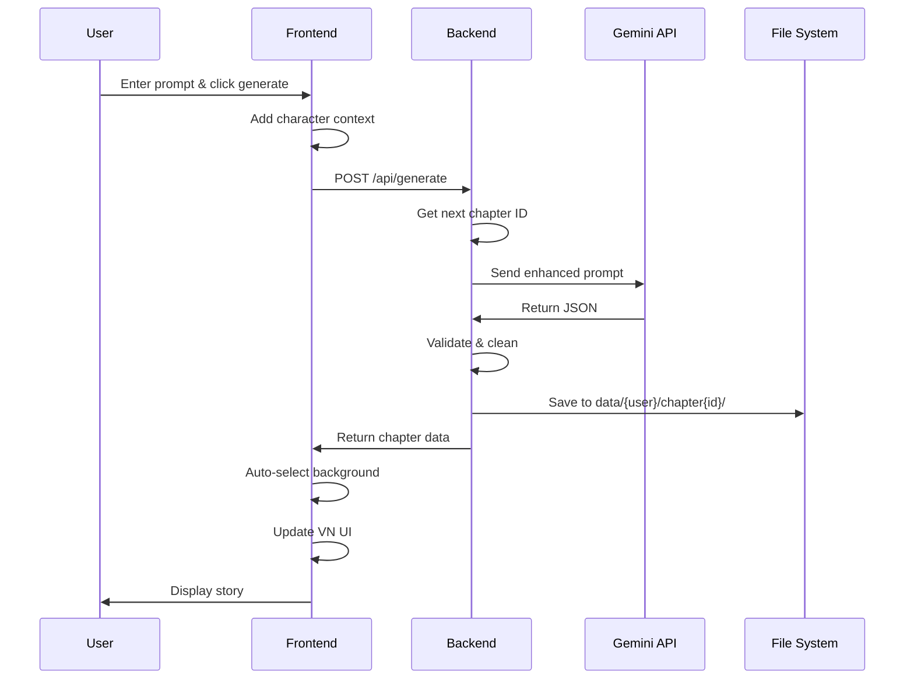
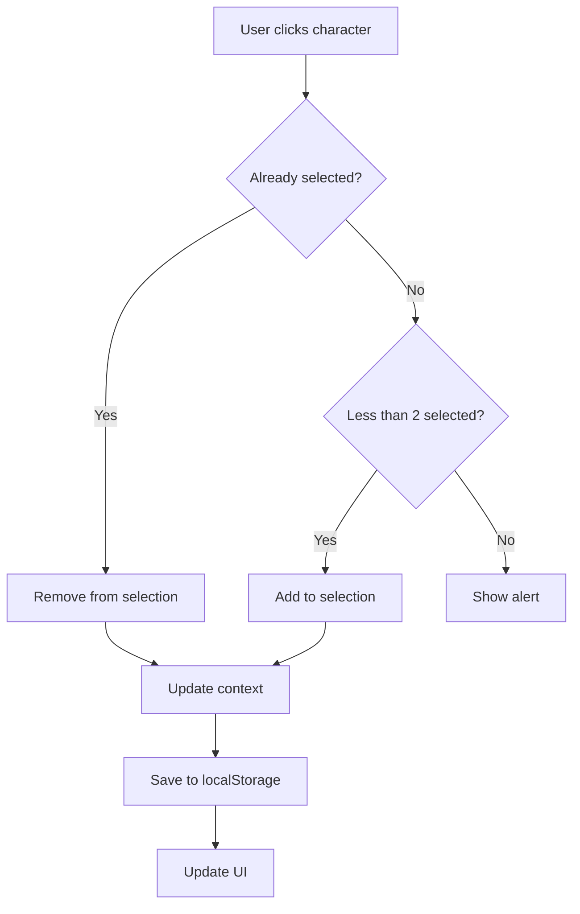

# Code Architecture Documentation

Deep dive into the codebase structure, design patterns, and implementation details.

## Project Structure

```
teyvatVN/
├── backend_server/          # Python FastAPI backend
│   ├── main.py             # API server & endpoints
│   ├── generate_ai_calls.py # AI generation logic
│   ├── utils.py            # Utility functions
│   ├── data/               # Generated chapters
│   ├── requirements.txt    # Python dependencies
│   └── .env               # Environment variables
│
├── src/                    # React frontend
│   ├── pages/             # Page components
│   ├── components/        # Reusable components
│   ├── context/           # React context providers
│   ├── data/              # Static data & configs
│   ├── config/            # Configuration files
│   └── assets/            # Images & media
│
├── docs/                   # Documentation
└── package.json           # Node dependencies
```

---

## Backend Architecture

### main.py - FastAPI Server

#### Endpoints

**POST /api/generate**
```python
@app.post("/api/generate")
async def generate_chapter(request: GenerateRequest):
    """
    Generate a new story chapter.
    
    Flow:
    1. Validate request (prompt, username)
    2. Get next chapter ID
    3. Call AI generation
    4. Save to file
    5. Return chapter data
    """
```

**GET /api/{username}/chapters**
```python
@app.get("/api/{username}/chapters")
async def get_user_chapters(username: str):
    """
    List all chapters for a user.
    
    Returns:
    - username
    - list of chapter IDs
    """
```

#### Data Models

```python
class GenerateRequest(BaseModel):
    prompt: str          # User's story prompt
    username: str        # User identifier

class GenerateResponse(BaseModel):
    status: str          # "success" or "error"
    data: dict          # Chapter JSON
    chapter_id: int     # Auto-incremented ID
```

#### CORS Configuration

```python
app.add_middleware(
    CORSMiddleware,
    allow_origins=["http://localhost:5173"],  # Frontend URL
    allow_credentials=True,
    allow_methods=["*"],
    allow_headers=["*"],
)
```

### generate_ai_calls.py - AI Generation

#### Main Function

```python
def generate_chapter_from_prompt(prompt: str) -> dict:
    """
    Generate visual novel chapter using Gemini AI.
    
    Steps:
    1. Define background options
    2. Build system instructions
    3. Configure generation parameters
    4. Call Gemini API
    5. Parse and clean JSON response
    6. Validate structure
    7. Return chapter data
    
    Returns:
        dict: Chapter with title, characters, backgrounds, segments
    """
```

#### Helper Functions

```python
def clean_json_string(json_str: str) -> str:
    """
    Remove markdown code blocks and clean JSON string.
    
    Handles:
    - ```json ... ``` blocks
    - ``` ... ``` blocks
    - Leading/trailing whitespace
    """
```

### utils.py - Chapter Management

```python
def get_next_chapter_id(username: str) -> int:
    """
    Auto-increment chapter ID for user.
    
    Logic:
    1. List existing chapters
    2. Find highest ID
    3. Return ID + 1
    """

def get_chapter_path(username: str, chapter_id: int) -> Path:
    """
    Get file path for chapter.
    
    Format: data/{username}/chapter{id}/output.json
    """

def list_user_chapters(username: str) -> List[int]:
    """
    List all chapter IDs for user.
    
    Returns sorted list of integers.
    """
```

---

## Frontend Architecture

### Page Components

#### StoryPage.jsx - Main Story Interface

**State Management:**
```javascript
const [prompt, setPrompt] = useState("");              // User input
const [selectedBackground, setSelectedBackground] = useState(null);  // Current bg
const [generatedStory, setGeneratedStory] = useState(null);  // AI output
const [isLoading, setIsLoading] = useState(false);     // Loading state
const [isFullscreen, setIsFullscreen] = useState(false);  // Fullscreen mode
```

**Key Functions:**
```javascript
handleGenerate()  // Generate story from prompt
handleReset()     // Navigate to character selection
handleSave()      // Save story (placeholder)
```

**Component Structure:**
```
StoryPage
├── Header (navigation)
├── Title Section
├── Prompt Input
│   ├── Text input
│   ├── Generate button
│   └── Loading indicator
├── Visual Novel UI
│   ├── Fullscreen wrapper
│   ├── Background image
│   ├── Character sprites
│   ├── VN Text Box
│   └── Fullscreen toggle
├── Background Selection
├── Generated Story Results
└── Footer
```

#### VNTextBox Component

```javascript
function VNTextBox({ segments }) {
  const [currentIndex, setCurrentIndex] = useState(0);
  
  // Navigation
  const handlePrev = () => { /* ... */ };
  const handleNext = () => { /* ... */ };
  
  // Render current segment
  return (
    <div className="vn-textbox-overlay">
      {/* Speaker name (if dialogue) */}
      {/* Dialogue/narration text */}
      {/* Prev/Next buttons */}
      {/* Progress indicator */}
    </div>
  );
}
```

#### CharactersPage.jsx - Character Selection

**State:**
```javascript
const { selectedCharacters, setSelectedCharacters } = useCharacters();
```

**Selection Logic:**
```javascript
const handleCharacterClick = (character) => {
  if (isSelected) {
    // Deselect
    setSelectedCharacters(prev => 
      prev.filter(c => c.name !== character.name)
    );
  } else if (selectedCharacters.length < 2) {
    // Select (max 2)
    setSelectedCharacters(prev => [...prev, character]);
  }
};
```

**Persistence:**
```javascript
// Save to localStorage on selection
localStorage.setItem("character1", char1.name);
localStorage.setItem("character2", char2.name);
```

### Context Providers

#### CharacterContext.jsx

```javascript
const CharacterContext = createContext();

export function CharacterProvider({ children }) {
  const [selectedCharacters, setSelectedCharacters] = useState([]);
  
  return (
    <CharacterContext.Provider value={{
      selectedCharacters,
      setSelectedCharacters
    }}>
      {children}
    </CharacterContext.Provider>
  );
}

export function useCharacters() {
  return useContext(CharacterContext);
}
```

### Configuration Files

#### backgrounds.js

```javascript
export const BACKGROUND_OPTIONS = [
  {
    id: string,           // Unique identifier
    displayName: string,  // UI display name
    description: string,  // AI selection hint
    fileName: string      // Asset filename
  }
];

// Helper functions
export function getBackgroundById(id) { /* ... */ }
export function getBackgroundByName(name) { /* ... */ }
export function getBackgroundIds() { /* ... */ }
export function getBackgroundDisplayNames() { /* ... */ }
```

#### characterData.js

```javascript
export const characterDatabase = {
  "CharacterName": {
    name: string,
    vision: string,
    weapon: string,
    rarity: number,
    cardImage: ImageImport,
    storySprites: {
      [emotion]: ImageImport
    },
    description: string
  }
};
```

---

## Data Flow Diagrams

### Story Generation Flow



### Character Selection Flow



---

## Design Patterns

### State Management Pattern

**Local State** (useState)
- Component-specific UI state
- Form inputs
- Loading states

**Context State** (React Context)
- Shared across components
- Character selection
- User preferences

**Persistent State** (localStorage)
- Survives page refresh
- Character selection
- Generated stories
- User settings

### Component Composition

```javascript
// Container Component
<StoryPage>
  {/* Presentational Components */}
  <Header />
  <PromptInput />
  <VNViewer>
    <Background />
    <CharacterSprites />
    <VNTextBox />
  </VNViewer>
  <Results />
</StoryPage>
```

### API Integration Pattern

```javascript
// Async/await with error handling
const handleGenerate = async () => {
  setIsLoading(true);
  try {
    const response = await fetch(API_URL, {
      method: "POST",
      headers: { "Content-Type": "application/json" },
      body: JSON.stringify(data)
    });
    
    if (!response.ok) throw new Error("Failed");
    
    const result = await response.json();
    // Handle success
  } catch (error) {
    // Handle error
  } finally {
    setIsLoading(false);
  }
};
```

---

## File Organization Best Practices

### Import Order

```javascript
// 1. React imports
import React, { useState, useEffect } from "react";

// 2. Third-party libraries
import { useNavigate } from "react-router-dom";
import { FiArrowRight } from "react-icons/fi";

// 3. Styles
import "./StoryPage.css";

// 4. Context/hooks
import { useCharacters } from "../context/CharacterContext";

// 5. Data/config
import { characterDatabase } from "../data/characterData.js";
import { BACKGROUND_OPTIONS } from "../config/backgrounds.js";

// 6. Components
import SegmentNavigator from "../components/SegmentNavigator";

// 7. Assets
import quillIcon from "../assets/images/quill.png";
import bg1 from "../assets/background/favonius-cathedral.jpg";
```

### Component Structure

```javascript
// 1. Imports
import ...

// 2. Constants
const CONSTANTS = {};

// 3. Helper functions
function helperFunction() {}

// 4. Sub-components
function SubComponent() {}

// 5. Main component
export default function MainComponent() {
  // State
  const [state, setState] = useState();
  
  // Context
  const context = useContext();
  
  // Effects
  useEffect(() => {}, []);
  
  // Handlers
  const handleEvent = () => {};
  
  // Render
  return ();
}
```

---

## Performance Considerations

### Image Optimization

```javascript
// Lazy load backgrounds
const backgrounds = BACKGROUND_OPTIONS.map(bg => ({
  id: bg.id,
  name: bg.displayName,
  src: backgroundImages[bg.id],
  loading: "lazy"  // Add lazy loading
}));
```

### Memoization

```javascript
// Memoize expensive computations
const processedSegments = useMemo(() => {
  return segments.map(processSegment);
}, [segments]);

// Memoize callbacks
const handleClick = useCallback(() => {
  // Handler logic
}, [dependencies]);
```

### Code Splitting

```javascript
// Lazy load pages
const CharactersPage = lazy(() => import("./pages/CharactersPage"));
const StoryPage = lazy(() => import("./pages/StoryPage"));

// Wrap in Suspense
<Suspense fallback={<Loading />}>
  <Routes>
    <Route path="/characters" element={<CharactersPage />} />
    <Route path="/story" element={<StoryPage />} />
  </Routes>
</Suspense>
```

---

## Error Handling

### Frontend Error Boundaries

```javascript
class ErrorBoundary extends React.Component {
  state = { hasError: false };
  
  static getDerivedStateFromError(error) {
    return { hasError: true };
  }
  
  componentDidCatch(error, errorInfo) {
    console.error("Error:", error, errorInfo);
  }
  
  render() {
    if (this.state.hasError) {
      return <ErrorFallback />;
    }
    return this.props.children;
  }
}
```

### Backend Error Handling

```python
@app.post("/api/generate")
async def generate_chapter(request: GenerateRequest):
    try:
        # Generation logic
        chapter_data = generate_chapter_from_prompt(request.prompt)
        return {
            "status": "success",
            "data": chapter_data
        }
    except ValueError as e:
        # Validation errors
        raise HTTPException(status_code=400, detail=str(e))
    except Exception as e:
        # Unexpected errors
        raise HTTPException(status_code=500, detail=str(e))
```

---

## Testing Strategy

### Unit Tests

```javascript
// Component tests
describe("VNTextBox", () => {
  it("renders dialogue correctly", () => {
    const segments = [
      { type: "dialogue", speaker: "Diluc", line: "Hello" }
    ];
    render(<VNTextBox segments={segments} />);
    expect(screen.getByText("Diluc")).toBeInTheDocument();
  });
  
  it("navigates between segments", () => {
    // Test navigation
  });
});
```

### Integration Tests

```python
# API tests
def test_generate_endpoint():
    response = client.post("/api/generate", json={
        "prompt": "Test prompt",
        "username": "test_user"
    })
    assert response.status_code == 200
    assert "data" in response.json()
```

### E2E Tests

```javascript
// Playwright/Cypress
test("full story generation flow", async () => {
  await page.goto("/characters");
  await page.click('[data-character="Diluc"]');
  await page.click('[data-character="Kaeya"]');
  await page.click("button:has-text('Continue')");
  
  await page.fill('input[placeholder*="prompt"]', "Test story");
  await page.click("button:has-text('Generate')");
  
  await expect(page.locator(".vn-textbox")).toBeVisible();
});
```

---

## Security Considerations

### API Key Protection

```python
# Never commit .env file
# Use environment variables
GEMINI_API_KEY = os.getenv("GEMINI_API_KEY")

if not GEMINI_API_KEY:
    raise ValueError("GEMINI_API_KEY not set")
```

### Input Validation

```python
# Validate user input
if not request.prompt or len(request.prompt) > 1000:
    raise HTTPException(400, "Invalid prompt")

if not request.username or not request.username.isalnum():
    raise HTTPException(400, "Invalid username")
```

### CORS Configuration

```python
# Restrict to specific origins
allow_origins=["http://localhost:5173"]  # Dev
# allow_origins=["https://yourdomain.com"]  # Prod
```

---

## Deployment Considerations

### Environment Variables

```bash
# .env.example
GEMINI_API_KEY=your_api_key_here
FRONTEND_URL=http://localhost:5173
BACKEND_PORT=4000
```

### Build Process

```bash
# Frontend build
npm run build

# Backend deployment
pip install -r requirements.txt
uvicorn main:app --host 0.0.0.0 --port 4000
```

### Docker Support

```dockerfile
# Dockerfile
FROM python:3.10
WORKDIR /app
COPY requirements.txt .
RUN pip install -r requirements.txt
COPY . .
CMD ["uvicorn", "main:app", "--host", "0.0.0.0", "--port", "4000"]
```

---

## Future Architecture Improvements

### Planned Enhancements

1. **Database Integration**
   - Replace file-based storage with PostgreSQL
   - Add user authentication
   - Track story history

2. **Caching Layer**
   - Redis for frequently accessed data
   - Cache AI responses
   - Session management

3. **Microservices**
   - Separate AI service
   - Character management service
   - Asset delivery service

4. **Real-time Features**
   - WebSocket for live generation updates
   - Collaborative story editing
   - Real-time notifications

---

**Related Documentation:**
- [Main README](./README.md)
- [AI Customization](./AI-CUSTOMIZATION.md)
- [Adding Characters](./ADDING-CHARACTERS.md)
- [Background Management](./BACKGROUND-MANAGEMENT.md)
