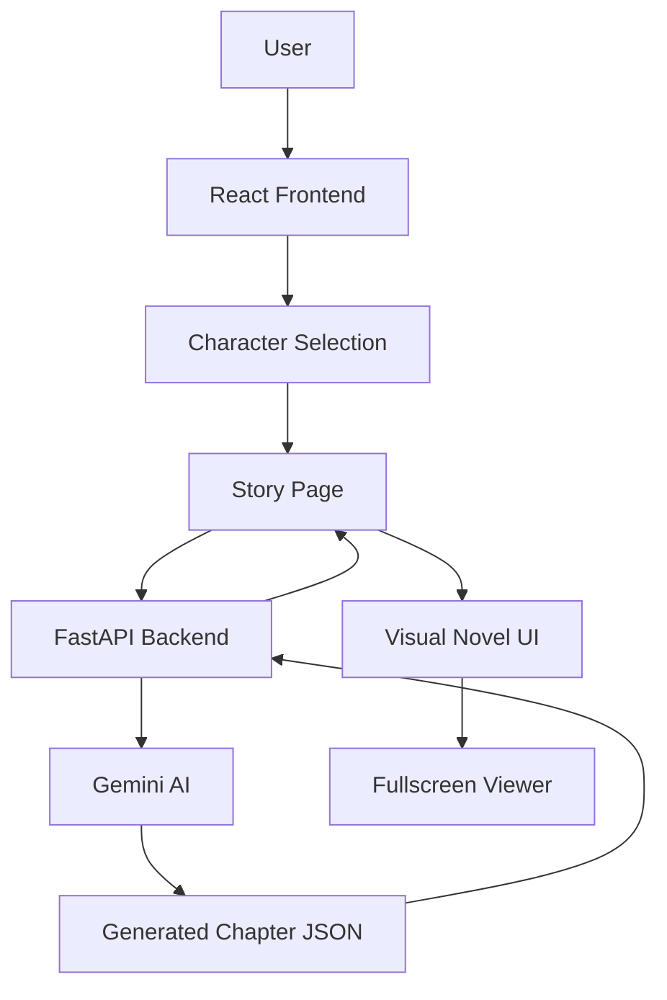

# TeyvatVN - Complete Documentation

## Table of Contents
1. [Project Overview](#project-overview)
2. [Architecture](#architecture)
3. [Setup & Installation](#setup--installation)
4. [How to Add New Content](#how-to-add-new-content)
5. [API Reference](#api-reference)
6. [Troubleshooting](#troubleshooting)

---

## Project Overview

**TeyvatVN** is a visual novel generator that uses Google's Gemini AI to create interactive story scenes featuring Genshin Impact characters. Users select characters, enter a prompt, and the AI generates a complete visual novel scene with dialogue, narration, and appropriate backgrounds.

### Key Features
- 🎭 **AI-Powered Story Generation** - Uses Gemini 2.5 Flash for creative writing
- 🎨 **Automatic Background Selection** - AI chooses appropriate scenes
- 📖 **Visual Novel Interface** - Interactive text box with character sprites
- 🖥️ **Fullscreen Mode** - Immersive viewing experience
- 💾 **Chapter Management** - Auto-incrementing chapter IDs and file storage
- 🔄 **Character Context** - AI incorporates selected characters into stories

### Tech Stack
- **Frontend**: React + Vite
- **Backend**: FastAPI (Python)
- **AI**: Google Gemini API
- **Styling**: Vanilla CSS
- **Routing**: React Router

---

## Architecture

### System Overview



### Directory Structure

```
teyvatVN/
├── backend_server/
│   ├── main.py                 # FastAPI server & endpoints
│   ├── generate_ai_calls.py    # AI generation logic
│   ├── utils.py                # Chapter management utilities
│   ├── data/                   # Generated chapters storage
│   │   └── {username}/
│   │       └── chapter{id}/
│   │           └── output.json
│   └── requirements.txt
│
├── src/
│   ├── pages/
│   │   ├── LandingPage.jsx     # Home page
│   │   ├── CharactersPage.jsx  # Character selection
│   │   ├── StoryPage.jsx       # Main story generation UI
│   │   └── TestScenePage.tsx   # Scene testing page
│   ├── components/
│   │   └── SegmentNavigator.tsx # Story segment display
│   ├── context/
│   │   └── CharacterContext.jsx # Character state management
│   ├── data/
│   │   ├── characterData.js    # Character database
│   │   └── sample_scene.json   # Fallback scene data
│   ├── config/
│   │   └── backgrounds.js      # Background configuration
│   └── assets/
│       ├── background/         # Background images
│       ├── characters/         # Character sprites
│       └── images/             # UI assets
│
└── docs/                       # Documentation
```

### Data Flow

#### 1. Character Selection Flow
```javascript
User selects characters
  ↓
CharacterContext stores selection
  ↓
localStorage.setItem("character1", name)
localStorage.setItem("character2", name)
  ↓
Navigate to /story
```

#### 2. Story Generation Flow
```javascript
User enters prompt
  ↓
Frontend adds character context
  ↓
POST /api/generate
  ↓
Backend calls Gemini AI
  ↓
AI returns structured JSON
  ↓
Backend saves to data/{username}/chapter{id}/output.json
  ↓
Frontend receives chapter data
  ↓
Auto-select background by ID
  ↓
Display in Visual Novel UI
```

### Key Components

#### Frontend Components

**StoryPage.jsx** - Main story generation interface
- Manages prompt input, background selection, and story display
- Handles fullscreen mode
- Integrates with AI generation API

**VNTextBox** - Visual novel text overlay
- Displays current dialogue/narration segment
- Navigation controls (Prev/Next)
- Progress indicator

**CharactersPage.jsx** - Character selection
- Grid display of available characters
- Multi-select functionality (2 characters)
- Persists selection to localStorage

#### Backend Modules

**main.py** - FastAPI server
- `/api/generate` - Generate new chapter
- `/api/{username}/chapters` - List user chapters
- CORS configuration for local development

**generate_ai_calls.py** - AI generation
- `generate_chapter_from_prompt()` - Main generation function
- Structured JSON output with validation
- Background selection logic

**utils.py** - Chapter management
- `get_next_chapter_id()` - Auto-increment chapter numbers
- `get_chapter_path()` - File path resolution
- `list_user_chapters()` - Chapter enumeration

---

## Setup & Installation

### Prerequisites
- **Node.js** v18+ and npm
- **Python** 3.10+
- **Google Gemini API Key** ([Get one here](https://aistudio.google.com/app/apikey))

### Backend Setup

1. **Navigate to backend directory**
   ```bash
   cd backend_server
   ```

2. **Create virtual environment**
   ```bash
   python -m venv venv
   
   # Windows
   venv\Scripts\activate
   
   # Mac/Linux
   source venv/bin/activate
   ```

3. **Install dependencies**
   ```bash
   pip install -r requirements.txt
   ```

4. **Configure environment**
   ```bash
   # Create .env file
   cp .env.example .env
   
   # Edit .env and add your API key
   GEMINI_API_KEY=your_api_key_here
   ```

5. **Start the server**
   ```bash
   python -m uvicorn main:app --reload --port 4000
   ```

   Server will run at `http://localhost:4000`

### Frontend Setup

1. **Navigate to project root**
   ```bash
   cd ..
   ```

2. **Install dependencies**
   ```bash
   npm install
   ```

3. **Start development server**
   ```bash
   npm run dev
   ```

   Frontend will run at `http://localhost:5173`

### Verify Installation

1. Open `http://localhost:5173` in your browser
2. Navigate to Characters page
3. Select 2 characters (e.g., Diluc and Kaeya)
4. Go to Story page
5. Enter a prompt: "A quiet evening at the tavern"
6. Click Generate
7. Story should appear with auto-selected background

---

## How to Add New Content

### Adding a New Character

Characters require card images, story sprites, and database entries.

#### Step 1: Prepare Assets

**Required Files:**
- Card image: `512x512px` PNG/JPG for character selection
- Story sprites: `Full-height` PNG with transparency for visual novel scenes

**File Locations:**
```
src/assets/characters/
├── cards/
│   └── new-character-card.png
└── story-sprites/
    └── new-character/
        ├── neutral.png
        ├── happy.png
        └── sad.png
```

#### Step 2: Update Character Database

Edit `src/data/characterData.js`:

```javascript
export const characterDatabase = {
  // ... existing characters
  
  "New Character": {
    name: "New Character",
    vision: "Pyro",  // Element type
    weapon: "Sword",
    rarity: 5,       // 4 or 5 star
    cardImage: newCharacterCard,  // Import at top
    storySprites: {
      neutral: newCharacterNeutral,
      happy: newCharacterHappy,
      sad: newCharacterSad,
    },
    description: "A brief character description for the selection screen"
  }
};
```

#### Step 3: Import Assets

At the top of `characterData.js`:

```javascript
// Card image
import newCharacterCard from "../assets/characters/cards/new-character-card.png";

// Story sprites
import newCharacterNeutral from "../assets/characters/story-sprites/new-character/neutral.png";
import newCharacterHappy from "../assets/characters/story-sprites/new-character/happy.png";
import newCharacterSad from "../assets/characters/story-sprites/new-character/sad.png";
```

#### Step 4: Test

1. Restart the dev server (`npm run dev`)
2. Navigate to Characters page
3. New character should appear in the grid
4. Select it and verify the card image displays correctly
5. Generate a story and verify the sprite appears in the VN UI

### Adding a New Background

Backgrounds use a standardized ID-based system for frontend/backend sync.

#### Step 1: Add Background Image

Place image in `src/assets/background/`:
```
src/assets/background/
└── new-location.jpg  (1920x1080px recommended)
```

#### Step 2: Update Frontend Configuration

Edit `src/config/backgrounds.js`:

```javascript
export const BACKGROUND_OPTIONS = [
  // ... existing backgrounds
  
  {
    id: "new_location",  // Unique ID (snake_case)
    displayName: "New Location",  // Human-readable name
    description: "Description to help AI choose this background",
    fileName: "new-location.jpg"
  }
];
```

#### Step 3: Import and Map Image

In `src/pages/StoryPage.jsx`:

```javascript
// Add import at top
import bgNew from "../assets/background/new-location.jpg";

// Add to backgroundImages mapping
const backgroundImages = {
  "favonius_cathedral": bg1,
  "mondstadt_night": bg2,
  "statue_of_seven": bg3,
  "angels_share": pageBg,
  "new_location": bgNew  // Add this line
};
```

#### Step 4: Update Backend AI Instructions

Edit `backend_server/generate_ai_calls.py`:

```python
def generate_chapter_from_prompt(prompt: str) -> dict:
    # Update BACKGROUND_OPTIONS list
    BACKGROUND_OPTIONS = [
        "favonius_cathedral",
        "mondstadt_night", 
        "statue_of_seven",
        "angels_share",
        "new_location"  # Add this
    ]
    
    # Update system instructions description
    system_instructions = """
    ...
    1. The "backgrounds" array must contain EXACTLY ONE background ID from this list:
       - "favonius_cathedral" (The grand cathedral of Mondstadt)
       - "mondstadt_night" (The city under the stars)
       - "statue_of_seven" (A statue dedicated to the Anemo Archon)
       - "angels_share" (Diluc's tavern, a popular gathering spot)
       - "new_location" (Your description here)  # Add this
    ...
    """
```

#### Step 5: Test

1. Restart both servers
2. Generate a story with a prompt mentioning the new location
3. AI should select the new background
4. Verify it displays correctly in the VN UI

### Adding a New Scene Type

To add custom scene templates or story types:

#### Step 1: Create Scene Template

Create `src/data/scene-templates/new-template.json`:

```json
{
  "title": "Template Title",
  "type": "custom_scene_type",
  "characters": ["Character1", "Character2"],
  "backgrounds": ["appropriate_background_id"],
  "setting_narration": "Template setting description",
  "segments": [
    {
      "type": "narration",
      "text": "Opening narration template"
    },
    {
      "type": "dialogue",
      "speaker": "Character1",
      "expression_action": "(smiling)",
      "line": "Template dialogue"
    }
  ]
}
```

#### Step 2: Create Scene Generator Function

In `backend_server/generate_ai_calls.py`:

```python
def generate_custom_scene(prompt: str, scene_type: str) -> dict:
    """Generate a specific type of scene."""
    
    # Load template
    template_path = f"../src/data/scene-templates/{scene_type}.json"
    with open(template_path) as f:
        template = json.load(f)
    
    # Customize system instructions for this scene type
    system_instructions = f"""
    Generate a {scene_type} scene based on the template structure.
    
    Template: {json.dumps(template, indent=2)}
    
    User Prompt: {prompt}
    
    Follow the template structure but customize content based on the prompt.
    """
    
    # Call AI with custom instructions
    # ... (similar to generate_chapter_from_prompt)
```

#### Step 3: Add API Endpoint

In `backend_server/main.py`:

```python
@app.post("/api/generate/custom")
async def generate_custom_scene_endpoint(request: GenerateRequest):
    """Generate a custom scene type."""
    try:
        scene_data = generate_custom_scene(
            request.prompt,
            request.scene_type  # Add scene_type to request model
        )
        
        # Save and return
        # ... (similar to existing endpoint)
    except Exception as e:
        raise HTTPException(status_code=500, detail=str(e))
```

---

## API Reference

### Backend Endpoints

#### POST /api/generate
Generate a new story chapter.

**Request Body:**
```json
{
  "prompt": "Story prompt text",
  "username": "user_id"
}
```

**Response:**
```json
{
  "status": "success",
  "data": {
    "title": "Chapter Title",
    "characters": ["Character1", "Character2"],
    "backgrounds": ["background_id"],
    "setting_narration": "Scene description",
    "segments": [
      {
        "type": "dialogue",
        "speaker": "Character1",
        "expression_action": "(smiling)",
        "line": "Dialogue text"
      }
    ]
  },
  "chapter_id": 1
}
```

#### GET /api/{username}/chapters
List all chapters for a user.

**Response:**
```json
{
  "username": "dawn",
  "chapters": [1, 2, 3, 4]
}
```

### Frontend Configuration

#### Background Configuration
Location: `src/config/backgrounds.js`

```javascript
export const BACKGROUND_OPTIONS = [
  {
    id: string,           // Unique identifier
    displayName: string,  // UI display name
    description: string,  // AI selection hint
    fileName: string      // Asset filename
  }
];
```

#### Character Data Structure
Location: `src/data/characterData.js`

```javascript
{
  name: string,
  vision: string,       // Element type
  weapon: string,
  rarity: number,       // 4 or 5
  cardImage: ImageImport,
  storySprites: {
    [emotion]: ImageImport
  },
  description: string
}
```

---

## Troubleshooting

### Common Issues

#### Backend won't start
**Error:** `ModuleNotFoundError: No module named 'fastapi'`

**Solution:**
```bash
# Ensure virtual environment is activated
cd backend_server
source venv/bin/activate  # or venv\Scripts\activate on Windows
pip install -r requirements.txt
```

#### Frontend shows CORS error
**Error:** `Access to fetch blocked by CORS policy`

**Solution:**
Verify backend CORS configuration in `main.py`:
```python
app.add_middleware(
    CORSMiddleware,
    allow_origins=["http://localhost:5173"],  # Frontend URL
    allow_credentials=True,
    allow_methods=["*"],
    allow_headers=["*"],
)
```

#### AI generation fails
**Error:** `Failed to generate story: API key not valid`

**Solution:**
1. Check `.env` file has correct API key
2. Verify API key at https://aistudio.google.com/app/apikey
3. Restart backend server after updating `.env`

#### Background not auto-selecting
**Issue:** Background stays empty after generation

**Debug Steps:**
1. Check console for: `Auto-selected background: {id} ({name})`
2. Verify background ID in generated JSON matches config
3. Check `backgroundImages` mapping in `StoryPage.jsx`
4. Ensure backend `BACKGROUND_OPTIONS` matches frontend config

#### Character sprites not showing
**Issue:** VN UI shows background but no characters

**Debug Steps:**
1. Verify characters are in localStorage:
   ```javascript
   console.log(localStorage.getItem("character1"));
   console.log(localStorage.getItem("character2"));
   ```
2. Check `characterDatabase` has correct sprite imports
3. Verify sprite file paths are correct
4. Check browser console for 404 errors on images

### Performance Optimization

#### Slow AI Generation
- **Cause:** Large token limits or complex prompts
- **Solution:** Reduce `max_output_tokens` in `generate_ai_calls.py`

#### Large Bundle Size
- **Cause:** Many high-res character sprites
- **Solution:** Compress images with tools like TinyPNG
- Recommended sizes:
  - Cards: 512x512px, <100KB
  - Sprites: <500KB per sprite
  - Backgrounds: 1920x1080px, <300KB

---

## Best Practices

### Code Organization
- Keep components focused and single-purpose
- Use consistent naming conventions (camelCase for JS, snake_case for Python)
- Document complex logic with comments
- Extract reusable logic into utility functions

### Asset Management
- Use descriptive filenames
- Organize by type (cards, sprites, backgrounds)
- Compress images before adding
- Use WebP format for better compression

### AI Prompt Engineering
- Be specific in system instructions
- Provide clear examples in prompts
- Validate AI output structure
- Handle edge cases gracefully

### State Management
- Use localStorage for persistence
- Keep React context minimal
- Clear old data when appropriate
- Handle missing data gracefully

---

## Future Enhancements

### Planned Features
- [ ] Multiple character support (3+)
- [ ] Custom character creation
- [ ] Story branching/choices
- [ ] Save/load story progress
- [ ] Export stories as PDF/images
- [ ] Voice acting integration
- [ ] Music and sound effects
- [ ] Mobile responsive design
- [ ] User authentication
- [ ] Story sharing/community features

### Extension Ideas
- Character relationship tracking
- Dynamic expression changes based on dialogue
- Animated transitions between scenes
- Mini-games or interactive elements
- Achievement system
- Story templates library

---

## Contributing

### Development Workflow
1. Create feature branch
2. Make changes
3. Test thoroughly
4. Update documentation
5. Submit pull request

### Code Style
- **JavaScript**: ESLint + Prettier
- **Python**: PEP 8
- **CSS**: BEM methodology

### Testing Checklist
- [ ] Character selection works
- [ ] Story generation completes
- [ ] Background auto-selects correctly
- [ ] VN UI displays properly
- [ ] Fullscreen mode functions
- [ ] Navigation controls work
- [ ] No console errors
- [ ] Mobile responsive (if applicable)

---

## License & Credits

### Assets
- Character sprites: Genshin Impact (miHoYo)
- Quill icon: Kangrif from Noun Project (CC BY 3.0)

### Technologies
- React + Vite
- FastAPI
- Google Gemini AI
- React Router

---

**Last Updated:** 2025-01-28
**Version:** 1.0.0
**Maintainer:** TeyvatVN Team
