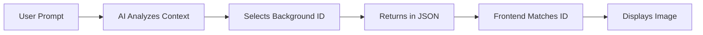

# Background Management Guide

Complete guide to adding, managing, and customizing backgrounds in TeyvatVN.

## Overview

Backgrounds in TeyvatVN use a **standardized ID-based system** to ensure perfect synchronization between the AI backend and frontend UI.

**Key Concepts:**
- Background IDs are unique identifiers (e.g., `"favonius_cathedral"`)
- AI selects backgrounds by ID based on story context
- Frontend automatically displays the matching background
- Manual override available for users

---

## Background System Architecture

### How It Works



### Configuration Files

| File | Purpose |
|------|---------|
| `src/config/backgrounds.js` | Frontend background definitions |
| `backend_server/generate_ai_calls.py` | Backend AI instructions |
| `src/pages/StoryPage.jsx` | Image imports and mapping |
| `src/assets/background/` | Background image files |

---

## Adding a New Background

### Step 1: Prepare Background Image

#### Image Specifications

- **Dimensions:** 1920x1080px (16:9 aspect ratio)
- **Format:** JPG or PNG
- **File Size:** < 300KB (compress if needed)
- **Content:** Clear, not too busy, suitable for text overlay

#### Recommended Tools

**Compression:**
- [TinyPNG](https://tinypng.com/)
- [Squoosh](https://squoosh.app/)
- ImageMagick: `convert input.jpg -quality 85 output.jpg`

**Sourcing:**
- Official game screenshots
- Fan art (with permission)
- AI-generated backgrounds
- Stock photos (with license)

#### Example Filenames
```
knights-headquarters.jpg
windrise-tree.jpg
dragonspine-peak.png
```

### Step 2: Add Image to Project

Place image in the backgrounds directory:

```bash
cd src/assets/background/
# Copy your image
cp /path/to/knights-headquarters.jpg .
```

**Directory Structure:**
```
src/assets/background/
├── favonius-cathedral.jpg
├── mondstadt-night.webp
├── statue-of-seven-day.png
├── goodNews.jpg
└── knights-headquarters.jpg  ← New background
```

### Step 3: Update Frontend Configuration

#### Edit `src/config/backgrounds.js`

Add new entry to `BACKGROUND_OPTIONS` array:

```javascript
export const BACKGROUND_OPTIONS = [
  {
    id: "favonius_cathedral",
    displayName: "Favonius Cathedral",
    description: "The grand cathedral of Mondstadt, a place of worship and solace",
    fileName: "favonius-cathedral.jpg"
  },
  // ... existing backgrounds
  
  // ADD THIS:
  {
    id: "knights_headquarters",  // Unique ID (snake_case)
    displayName: "Knights of Favonius HQ",  // Display name
    description: "The headquarters where the Knights of Favonius operate",  // AI hint
    fileName: "knights-headquarters.jpg"  // Filename
  }
];
```

#### Field Descriptions

| Field | Format | Purpose | Example |
|-------|--------|---------|---------|
| `id` | snake_case | Unique identifier for matching | `"knights_headquarters"` |
| `displayName` | Title Case | Human-readable name for UI | `"Knights of Favonius HQ"` |
| `description` | Sentence | Helps AI choose appropriately | `"The headquarters where..."` |
| `fileName` | kebab-case.ext | Asset filename | `"knights-headquarters.jpg"` |

### Step 4: Import and Map Image

#### Edit `src/pages/StoryPage.jsx`

**Add import at top:**
```javascript
// Existing imports
import bg1 from "../assets/background/favonius-cathedral.jpg";
import bg2 from "../assets/background/mondstadt-night.webp";
import bg3 from "../assets/background/statue-of-seven-day.png";
import pageBg from "../assets/background/goodNews.jpg";

// ADD THIS:
import bgKnights from "../assets/background/knights-headquarters.jpg";
```

**Add to mapping object:**
```javascript
const backgroundImages = {
  "favonius_cathedral": bg1,
  "mondstadt_night": bg2,
  "statue_of_seven": bg3,
  "angels_share": pageBg,
  "knights_headquarters": bgKnights  // ADD THIS LINE
};
```

### Step 5: Update Backend AI Instructions

#### Edit `backend_server/generate_ai_calls.py`

**Update BACKGROUND_OPTIONS list:**
```python
def generate_chapter_from_prompt(prompt: str) -> dict:
    # Standardized background options (must match frontend config)
    BACKGROUND_OPTIONS = [
        "favonius_cathedral",
        "mondstadt_night", 
        "statue_of_seven",
        "angels_share",
        "knights_headquarters"  # ADD THIS
    ]
```

**Update system instructions:**
```python
    system_instructions = """
    ...
    1. The "backgrounds" array must contain EXACTLY ONE background ID from this list:
       - "favonius_cathedral" (The grand cathedral of Mondstadt)
       - "mondstadt_night" (The city under the stars)
       - "statue_of_seven" (A statue dedicated to the Anemo Archon)
       - "angels_share" (Diluc's tavern, a popular gathering spot)
       - "knights_headquarters" (The headquarters where the Knights of Favonius operate)  # ADD THIS
    2. Choose the background that best matches the scene setting and prompt
    ...
    """
```

### Step 6: Test the Background

#### 1. Restart Servers

```bash
# Terminal 1 - Backend
cd backend_server
python -m uvicorn main:app --reload --port 4000

# Terminal 2 - Frontend
cd ..
npm run dev
```

#### 2. Test Auto-Selection

1. Navigate to `http://localhost:5173/story`
2. Enter prompt: "A meeting at the Knights of Favonius headquarters"
3. Click Generate
4. **Verify:**
   - Console shows: `Auto-selected background: knights_headquarters (Knights of Favonius HQ)`
   - Background image displays in VN UI
   - No 404 errors in console

#### 3. Test Manual Selection

1. Scroll to background selection section
2. New background should appear in grid
3. Click to select manually
4. Verify it displays in VN UI

---

## Advanced Configuration

### Custom Background Sizes

If a background needs special sizing:

```css
/* In StoryPage.css */
.visual-novel-ui[style*="knights-headquarters"] {
  background-size: contain;  /* Instead of cover */
  background-position: top center;
}
```

### Conditional Backgrounds

To make backgrounds available only in certain contexts:

```javascript
// In backgrounds.js
export const BACKGROUND_OPTIONS = [
  {
    id: "secret_location",
    displayName: "Secret Location",
    description: "A hidden area",
    fileName: "secret.jpg",
    unlocked: false  // Custom field
  }
];

// Filter in StoryPage.jsx
const backgrounds = BACKGROUND_OPTIONS
  .filter(bg => bg.unlocked !== false)
  .map(bg => ({
    id: bg.id,
    name: bg.displayName,
    src: backgroundImages[bg.id]
  }));
```

### Time-of-Day Variants

Create multiple versions of the same location:

```javascript
{
  id: "mondstadt_day",
  displayName: "Mondstadt (Day)",
  description: "The city of Mondstadt during daytime",
  fileName: "mondstadt-day.jpg"
},
{
  id: "mondstadt_night",
  displayName: "Mondstadt (Night)",
  description: "The city of Mondstadt under the stars",
  fileName: "mondstadt-night.webp"
},
{
  id: "mondstadt_sunset",
  displayName: "Mondstadt (Sunset)",
  description: "The city of Mondstadt at golden hour",
  fileName: "mondstadt-sunset.jpg"
}
```

### Weather Variants

```javascript
{
  id: "dragonspine_clear",
  displayName: "Dragonspine (Clear)",
  description: "The snowy mountain on a clear day",
  fileName: "dragonspine-clear.jpg"
},
{
  id: "dragonspine_storm",
  displayName: "Dragonspine (Storm)",
  description: "The mountain during a fierce snowstorm",
  fileName: "dragonspine-storm.jpg"
}
```

---

## Background Categories

### Organizing Backgrounds

Group backgrounds by category for better AI selection:

```javascript
export const BACKGROUND_CATEGORIES = {
  mondstadt: [
    "favonius_cathedral",
    "angels_share",
    "knights_headquarters",
    "mondstadt_night"
  ],
  liyue: [
    "liyue_harbor",
    "wangshu_inn",
    "jueyun_karst"
  ],
  inazuma: [
    "inazuma_city",
    "narukami_shrine",
    "tenshukaku"
  ]
};
```

Update AI instructions to use categories:

```python
system_instructions = f"""
Available backgrounds by region:

Mondstadt:
- favonius_cathedral (Cathedral)
- angels_share (Tavern)
- knights_headquarters (HQ)

Liyue:
- liyue_harbor (Harbor)
- wangshu_inn (Inn)

Choose the background that best matches the prompt's location and atmosphere.
"""
```

---

## Best Practices

### Image Quality
- ✅ Use high resolution source images
- ✅ Maintain consistent color grading
- ✅ Ensure good contrast for text readability
- ✅ Avoid overly busy/distracting backgrounds

### Naming Conventions
- ✅ Use descriptive, unique IDs
- ✅ Keep display names concise
- ✅ Write clear descriptions for AI
- ✅ Use consistent file naming

### Performance
- ✅ Compress images to < 300KB
- ✅ Use WebP format when possible
- ✅ Lazy load backgrounds not immediately visible
- ✅ Provide low-res placeholders for slow connections

### AI Selection
- ✅ Write detailed descriptions
- ✅ Include location keywords
- ✅ Mention atmosphere/mood
- ✅ Specify time of day if relevant

---

## Troubleshooting

### Background Not Auto-Selecting

**Problem:** AI generates story but background stays empty

**Debug Steps:**

1. **Check Console Logs**
   ```javascript
   // Should see:
   "Auto-selected background: background_id (Display Name)"
   
   // If you see warning:
   "Background ID 'xyz' not found in available backgrounds"
   ```

2. **Verify ID Matching**
   - Backend `BACKGROUND_OPTIONS` list
   - Frontend `backgrounds.js` config
   - `backgroundImages` mapping
   - All must use identical IDs

3. **Check Generated JSON**
   ```javascript
   console.log(result.data.backgrounds);
   // Should output: ["background_id"]
   ```

### Background Image Not Loading

**Problem:** Background selected but shows broken/blank

**Solutions:**

1. **Check Import Path**
   ```javascript
   // Verify file exists at this path
   import bgKnights from "../assets/background/knights-headquarters.jpg";
   ```

2. **Check Mapping**
   ```javascript
   const backgroundImages = {
     "knights_headquarters": bgKnights  // ID must match config
   };
   ```

3. **Check Browser Console**
   - Look for 404 errors
   - Verify image path is correct
   - Check network tab for failed requests

### Background Displays Incorrectly

**Problem:** Background is stretched, cropped, or positioned wrong

**Solutions:**

1. **Adjust CSS**
   ```css
   .visual-novel-ui {
     background-size: cover;  /* or contain */
     background-position: center;  /* or top, bottom, etc. */
   }
   ```

2. **Resize Source Image**
   - Ensure 16:9 aspect ratio (1920x1080)
   - Crop to focus on important elements

3. **Use Custom Styling**
   ```css
   .visual-novel-ui[style*="specific-background"] {
     background-size: 120%;
     background-position: center bottom;
   }
   ```

---

## Complete Example

Adding "Wangshu Inn" background:

### 1. Prepare Image
```bash
# Resize and compress
convert wangshu-inn-original.jpg -resize 1920x1080 -quality 85 wangshu-inn.jpg

# Move to project
cp wangshu-inn.jpg src/assets/background/
```

### 2. Update Config
```javascript
// src/config/backgrounds.js
{
  id: "wangshu_inn",
  displayName: "Wangshu Inn",
  description: "A tall inn in Liyue offering views of the surrounding landscape",
  fileName: "wangshu-inn.jpg"
}
```

### 3. Import and Map
```javascript
// src/pages/StoryPage.jsx
import bgWangshu from "../assets/background/wangshu-inn.jpg";

const backgroundImages = {
  // ... existing
  "wangshu_inn": bgWangshu
};
```

### 4. Update Backend
```python
# backend_server/generate_ai_calls.py
BACKGROUND_OPTIONS = [
    # ... existing
    "wangshu_inn"
]

system_instructions = """
...
- "wangshu_inn" (A tall inn in Liyue offering views)
...
"""
```

### 5. Test
```bash
# Restart servers
# Generate story with prompt: "A meeting at Wangshu Inn"
# Verify background auto-selects
```

---

## Future Enhancements

### Planned Features
- [ ] Animated backgrounds (subtle motion)
- [ ] Parallax scrolling effects
- [ ] Weather overlays (rain, snow)
- [ ] Time-of-day transitions
- [ ] Custom background upload
- [ ] Background blur for text readability

### Extension Ideas
- Dynamic lighting based on time
- Seasonal variants
- Interactive background elements
- 360° panoramic backgrounds
- Video backgrounds

---

**Related Documentation:**
- [Main README](./README.md)
- [Adding Characters](./ADDING-CHARACTERS.md)
- [AI Customization](./AI-CUSTOMIZATION.md)
